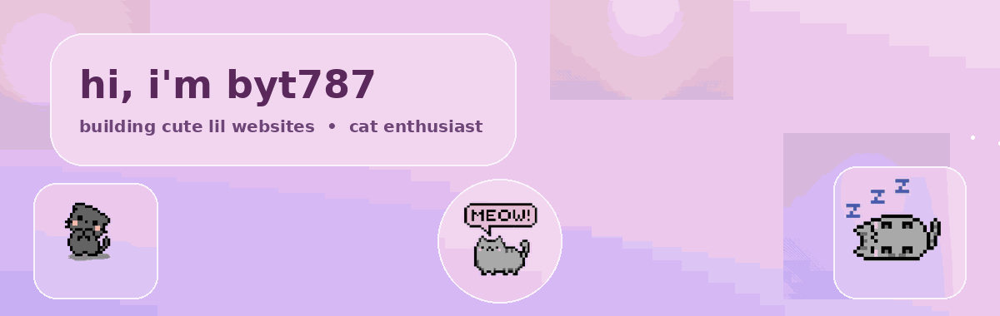

 

  

🌙 web developer building things for fun &nbsp;•&nbsp; 🐱 certified cat person &nbsp;•&nbsp; 🎨 into art + design on the side  
🎧 music taste is... eclectic, to say the least &nbsp;•&nbsp; ✨ always tinkering with a new project

 

  

 

  

 

  

| project | about |
|---|---|
| 🎮 [`flappy`](https://github.com/byt787/flappy) | flappy bird clone |
| 🕹️ [`retro-games`](https://github.com/byt787/retro-games) | collection of retro-style games |
| 🔄 [`flipr`](https://github.com/byt787/flipr) | little flip-based project |
| 🏖️ [`Australian-Holidays`](https://github.com/byt787/Australian-Holidays) | holidays site |
| 📘 [`info-lernen`](https://github.com/byt787/info-lernen) | learning resource site |
| 🧠 [`depression-self-test`](https://github.com/byt787/depression-self-test) | self-test web project |

 

  

<!-- add your social badges here, e.g.: -->
<!--  -->

  
˚₊· ͟͟͞͞➳❥ thanks for stopping by ‧₊˚ ⋅

