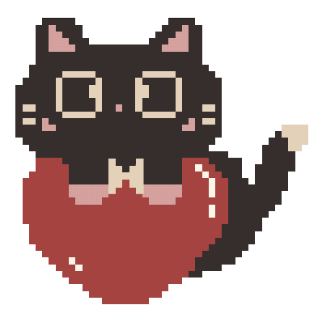

# hi, i'm byt787 🌸

web dev • cat person • always tinkering with something new

### 🌸 about me
- 🌙 web developer building things for fun
- 🐱 certified cat person
- 🎨 into art + design on the side
- ✨ always tinkering with a new project

### ⚙️ skills

### ✨ github stats

### 💜 connect

<!-- add socials here: -->
<!--  -->

˚₊· ͟͟͞͞➳❥ thanks for stopping by ‧₊˚ ⋅

